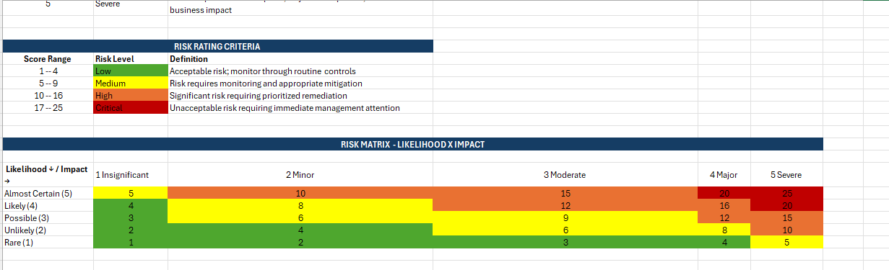
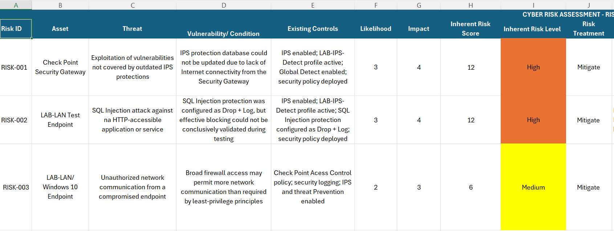
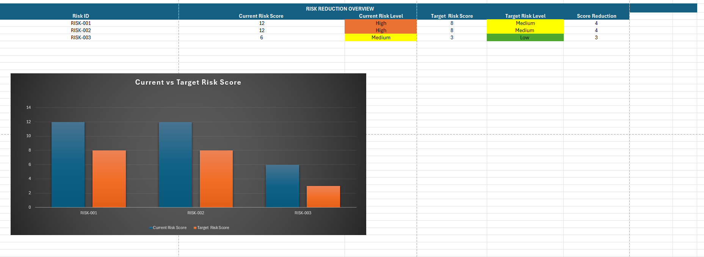

# Technical Cyber Risk Assessment – Check Point R82

Technical cyber risk and control assessment performed in a controlled Check Point R82 laboratory environment.

The project demonstrates an evidence-based approach to identifying cybersecurity risks, evaluating control effectiveness, calculating inherent and target residual risk, and defining remediation actions.

## Project Objectives

- Identify technical cybersecurity risks
- Evaluate existing security controls
- Document supporting technical evidence
- Assess likelihood and business/security impact
- Calculate inherent risk exposure
- Define risk treatment actions
- Estimate target residual risk
- Present technical findings in an executive format

## Assessment Scope

The assessment covers:

- Check Point Security Gateway R82
- Firewall Access Control
- Intrusion Prevention System (IPS)
- Threat Prevention
- Security Logging
- Network Segmentation
- Security Policy Configuration
- Laboratory Windows endpoint

## Methodology

The assessment follows an asset, threat, vulnerability, control and evidence-based risk analysis methodology.

Risk is calculated using:

**Risk Score = Likelihood × Impact**

Both Likelihood and Impact are rated from 1 to 5, producing a 5×5 risk matrix.

| Score | Risk Level |
|---|---|
| 1–4 | Low |
| 5–9 | Medium |
| 10–16 | High |
| 17–25 | Critical |

## Risk Matrix

## Key Risks Identified

Three primary risk scenarios were documented during the assessment:

### RISK-001 – Outdated IPS Protection Coverage

The IPS protection database could not be updated because of restricted Internet connectivity from the Security Gateway.

**Inherent Risk:** High (12)  
**Target Risk:** Medium (8)

### RISK-002 – SQL Injection Protection Validation

SQL Injection protection was configured as Drop + Log, but effective blocking could not be conclusively validated during controlled testing.

**Inherent Risk:** High (12)  
**Target Risk:** Medium (8)

### RISK-003 – Broad Network Access

Broad firewall access was intentionally permitted within the laboratory environment, creating a scenario that would require stricter least-privilege controls in production.

**Inherent Risk:** Medium (6)  
**Target Risk:** Low (3)

## Risk Register

## Risk Treatment

Risk treatment activities include:

- Restoring controlled connectivity for IPS protection updates
- Verifying IPS protection database currency
- Performing controlled SQL Injection validation
- Reviewing firewall rules using least-privilege principles
- Restricting unnecessary network destinations and services
- Maintaining technical evidence for remediation validation

## Risk Reduction

The proposed remediation measures reduce the assessed risk exposure:

| Risk | Current | Target | Reduction |
|---|---:|---:|---:|
| RISK-001 | 12 (High) | 8 (Medium) | 4 |
| RISK-002 | 12 (High) | 8 (Medium) | 4 |
| RISK-003 | 6 (Medium) | 3 (Low) | 3 |

## Executive Risk View

## Assessment Workbook

The complete assessment workbook is available in: 

`assessment/Cyber_Risk_Assessment.xlsx`

It contains:

- Risk Criteria
- Risk Register
- Asset Register
- Control Register
- Evidence Register
- Risk Treatment Plan
- Executive Summary

## Skills Demonstrated

- Cyber Risk Assessment
- Risk Analysis
- Security Control Assessment
- Evidence-Based Assessment
- Firewall Security
- Intrusion Prevention
- Threat Prevention
- Risk Treatment Planning
- Security Documentation
- Executive Risk Reporting
- Check Point R82

## Disclaimer

This project was developed in a controlled cybersecurity laboratory environment for educational and professional portfolio purposes.

No production systems, confidential organizational information, customer data, or unauthorized third-party systems were used.
